# في رحاب الرحمن | In the Presence of the Most Merciful


> تطبيق إسلامي شامل مجاني — صدقة جارية: قرآن كريم، أذكار، سبحة، مواقيت الصلاة، اتجاه القبلة، أحاديث، إحصائيات عبادة.
>
> A comprehensive free Islamic app: Quran, Azkar, Sibha, Prayer times, Qibla, Hadith, and worship statistics.

## 📱 لقطات | Screenshots

<p align="center">
  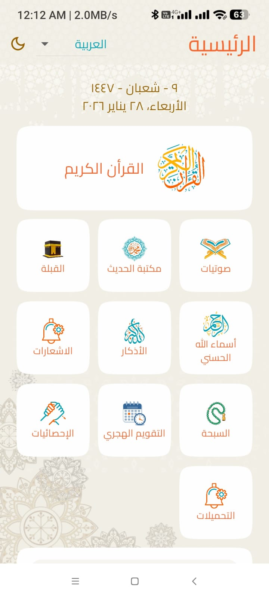
  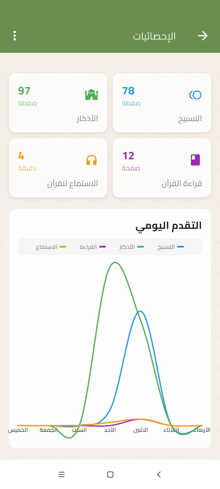
  
  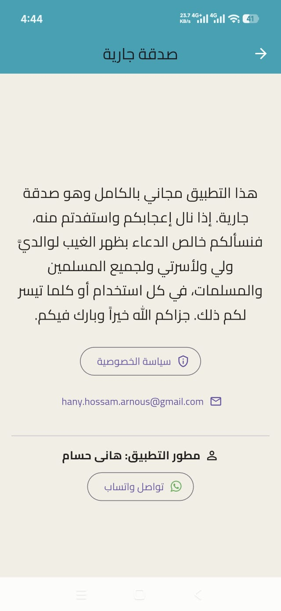
  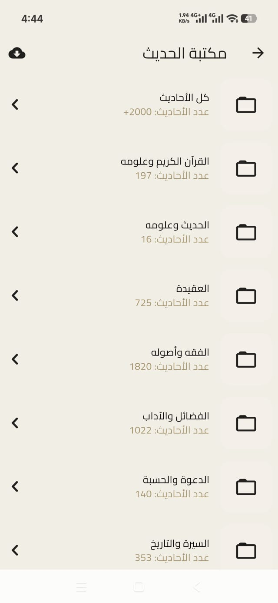
  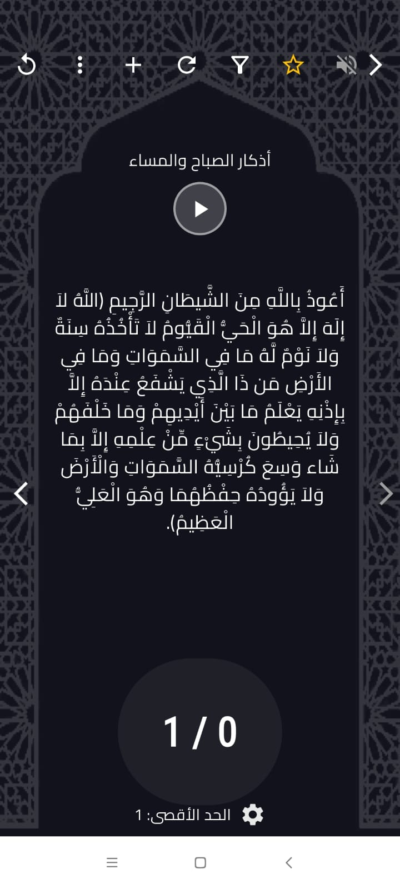
</p>

<details>
<summary>باقي الصور (7-12)</summary>
<p align="center">
  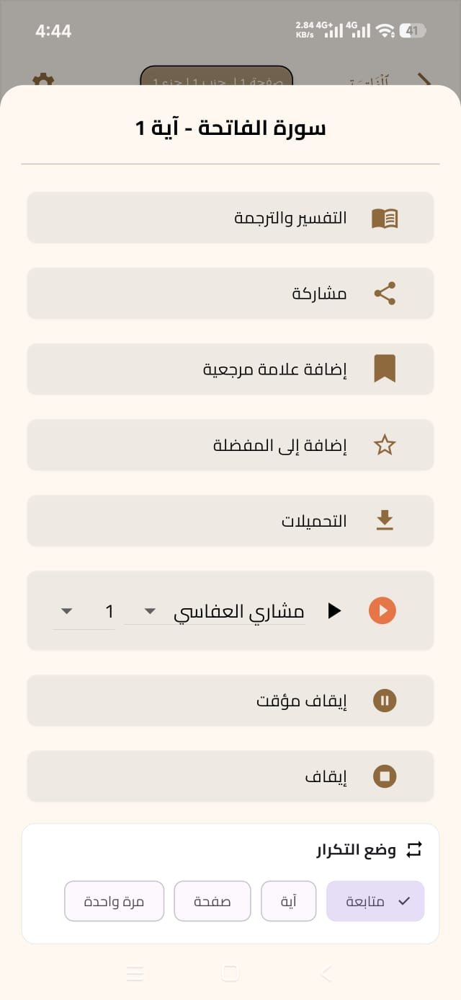
  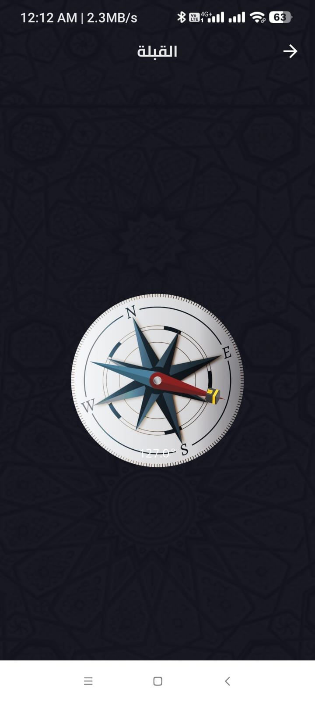
  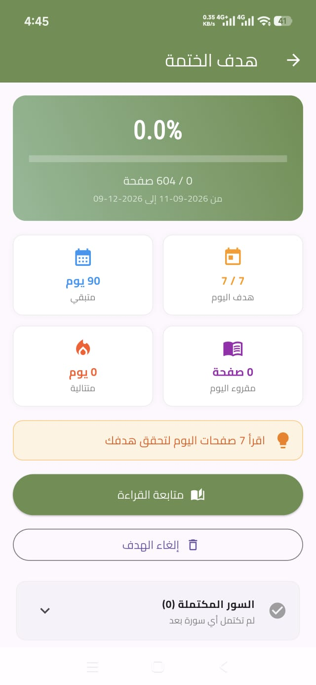
  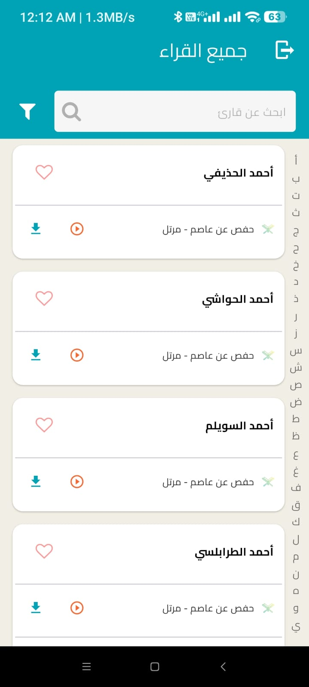
  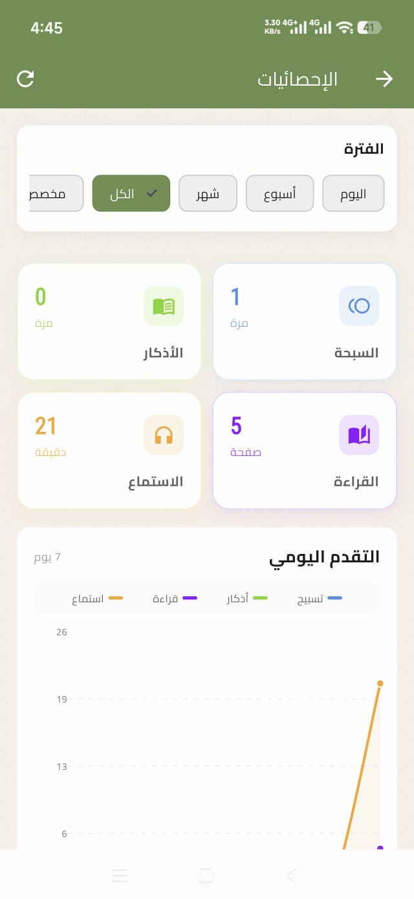
  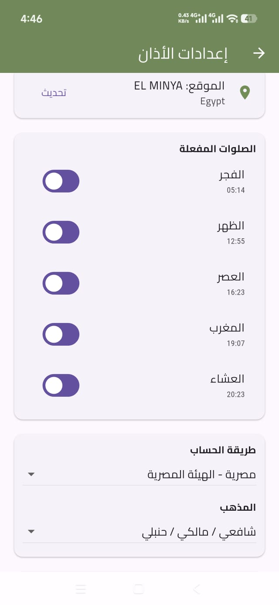
</p>
</details>

## ✨ المميزات | Features

- 📖 **مصحف كامل** بخطوط عثمانية + وضع Bold لراحة العين
- 🔊 **تلاوات صوتية** + تشغيل في الخلفية + إدارة التحميلات والمساحة
- 📿 **أذكار وسبحة** مع CRUD للأقسام، انتقال تلقائي، مفضلة، زر تصفير شامل
- 📊 **إحصائيات** يومية/أسبوعية برسوم `fl_chart` + مقارنة زمنية
- 🕌 **مواقيت الصلاة + منبه أذان** (`SCHEDULE_EXACT_ALARM` مع بديل) + شاشة أذان كاملة (`USE_FULL_SCREEN_INTENT`)
- 🧭 **بوصلة القبلة** بمستشعرات الجهاز
- 📚 **أحاديث، أدعية، أسماء الله الحسنى، ختمة**
- 🌍 **9 لغات** + 🌙 **وضع ليلي** + Hive للتخزين المحلي السريع

## 🛠 التقنيات | Tech Stack

`Flutter 3.38` • `Dart` • `BLoC` • `Hive` • `fl_chart` • `just_audio / audioplayers` • `flutter_local_notifications + WorkManager` • `Geolocator`

## 🚀 التشغيل | Getting Started

```bash
git clone https://github.com/HanyArnous/In_the_Presence_of_the_Quran-Flutter-Islamic.git
cd In_the_Presence_of_the_Quran-Flutter-Islamic
flutter pub get
flutter run
```

- Flutter المطلوب: `3.38.x` أو أعلى
- Android SDK: `API 35`
- الحزمة: `com.hanyarnous.quranpresence` — الإصدار `4.6.0+460`

## 🔐 الخصوصية | Privacy

- سياسة الخصوصية (مطلوبة لمراجعة Google Play):
  **https://hanyarnous.github.io/In_the_Presence_of_the_Quran-Flutter-Islamic/privacy.html**
- المصدر: [`docs/privacy.html`](docs/privacy.html)
- لتفعيل الرابط: GitHub → `Settings > Pages > Deploy from branch: main /docs`
- داخل التطبيق: صفحة `صدقة جارية > سياسة الخصوصية`

## 📦 الإصدارات | Releases

- `v4.6.0` — الأذان ForegroundService + تتبع الختمة + إحصائيات متقدمة + Hive
- بدون مرفق APK حاليا — نسخة تجريبية قديمة: [MediaFire V4.5](https://www.mediafire.com/file/id5r5jfqiw3ucmn/QuranKareemV4.5.apk/file)

## 🤝 التواصل | Contact

- المطور: **Hany Arnous** — https://github.com/HanyArnous
- البريد: `hany.hossam.arnous@gmail.com`
- البلاغات: [GitHub Issues](https://github.com/HanyArnous/In_the_Presence_of_the_Quran-Flutter-Islamic/issues)

## 📄 الرخصة | License

MIT — انظر ملف [LICENSE](LICENSE).
